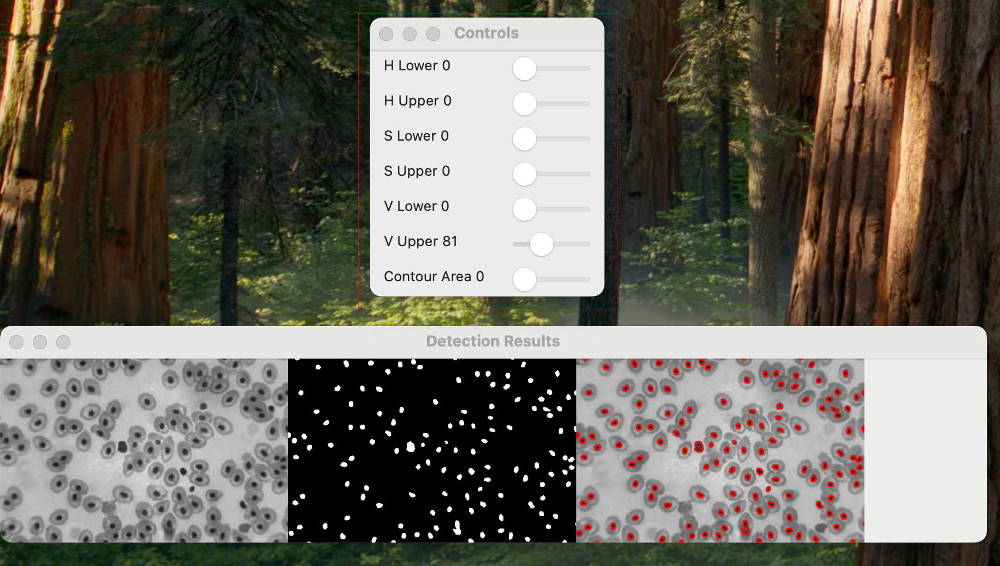

# Blood Cell Detection

This project is a computer vision application for detecting and counting blood cells in a microscopic image using OpenCV and Python. The program provides interactive controls for adjusting the HSV (Hue, Saturation, Value) color ranges and contour area threshold to accurately detect and count cells based on their visual characteristics.

## Features

- **BMP to Grayscale PNG Conversion**: Converts BMP images to grayscale PNG format for processing.
- **HSV Color Masking**: Applies a color mask in HSV format to isolate blood cell regions.
- **Interactive Trackbars**: Allows for real-time adjustments of HSV color range and contour area threshold to fine-tune cell detection.
- **Contour-Based Cell Counting**: Counts cells by detecting contours that meet a specified area threshold, with results overlaid in red.
- **Single-Window Display**: Combines the original grayscale image, binary mask, and detected cells with contour overlays into a single, dynamically updating window.

## Requirements

- Python 3.x
- OpenCV
- NumPy

Install the required packages using:

```bash
pip install opencv-python numpy
```

## Usage

1. **Place the Image**: Save your BMP image (e.g., `bloodcell.bmp`) in a folder named `pic/` at the same directory level as the script.

2. **Run the Script**: Execute the script by running:

   ```bash
   python cell_detection.py
   ```

3. **Adjust Settings Using Trackbars**:

   - Use the sliders in the `Controls` window to adjust the following settings:
     - **H Lower** and **H Upper**: Set the range for the Hue channel to target specific colors.
     - **S Lower** and **S Upper**: Adjust the Saturation bounds to refine color selection.
     - **V Lower** and **V Upper**: Modify the Value range to control the brightness levels of the cells.
     - **Contour Area**: Set the minimum contour area to exclude small, non-cell-like objects from detection.
   - As you adjust the trackbars, the results update in real-time in a single display window titled `Detection Results`.

4. **Understanding the Display**:

   - **Left Panel**: The original grayscale image.
   - **Middle Panel**: The binary mask that highlights potential cell regions based on the current HSV filter settings.
   - **Right Panel**: The detected cells overlaid with red contours on the original image, showing the identified cells that match the contour area threshold.

   

   This setup allows you to visually assess the effectiveness of your HSV range and contour area settings in isolating and detecting cells.

5. **Exit**: Press `q` in the `Detection Results` window to exit the program.

## Example

The following screenshot provides a visual of the application interface:

- The **Controls** window on the top allows you to adjust HSV and contour area settings.
- The **Detection Results** window on the bottom displays:
  - The **original image** in grayscale (left panel).
  - The **binary mask** highlighting cell-like regions based on the HSV filter (middle panel).
  - The **detected cells** with red contour overlays on the original image (right panel).



This layout enables you to fine-tune the detection parameters visually, ensuring accurate cell detection.

## Code Summary

The script processes images in the following steps:

1. **Image Conversion**: Converts an initial BMP image to a grayscale PNG, which is then read and converted to HSV format for color masking.
2. **HSV Masking**: Adjusts the HSV range using interactive trackbars to create a binary mask that isolates cell regions based on color.
3. **Contour Detection and Filtering**: Finds contours in the masked image and filters them based on area to detect cells.
4. **Combined Display**: Shows the original, mask, and contour-drawn images in a single window, updating in real-time.

## Detection Summary

Based on the provided settings and example screenshot, the following detection results were observed:

- **Total Detected Cells**: **130**
- **HSV Threshold Settings**:
  - **Lower HSV Bound**: `[0, 0, 0]`
  - **Upper HSV Bound**: `[0, 0, 80]`
- **Contour Area Threshold**: `0`

These settings focus on isolating low-saturation, low-brightness regions, which represent cell-like structures. The contour area threshold of 0 includes all detected contours, making it suitable for detecting smaller structures.

## Future Improvements

- Add automatic thresholding for initial HSV range and contour area based on image properties.
- Implement more advanced segmentation techniques for more complex images.

## License

This project is open-source and available under the MIT License.
